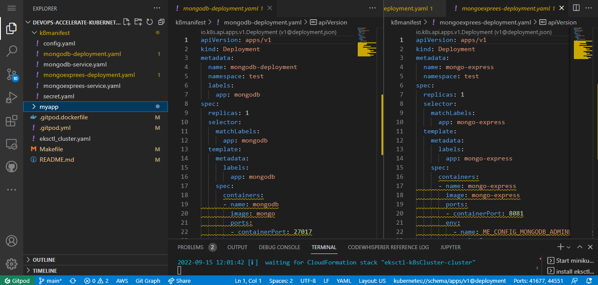
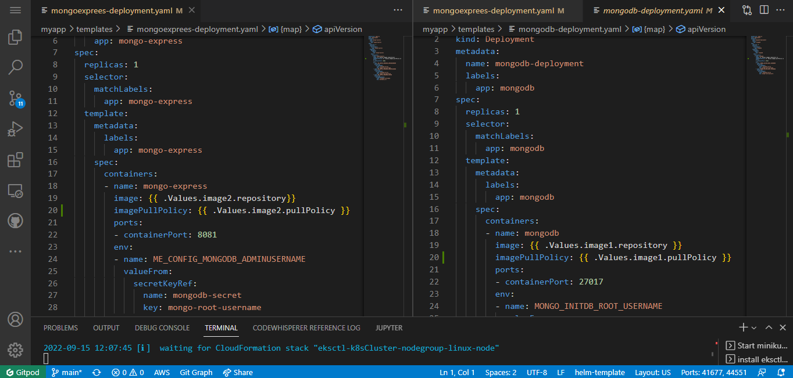
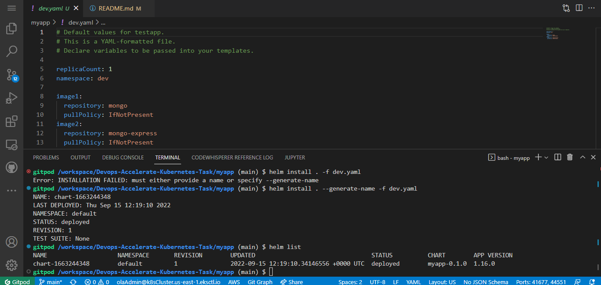
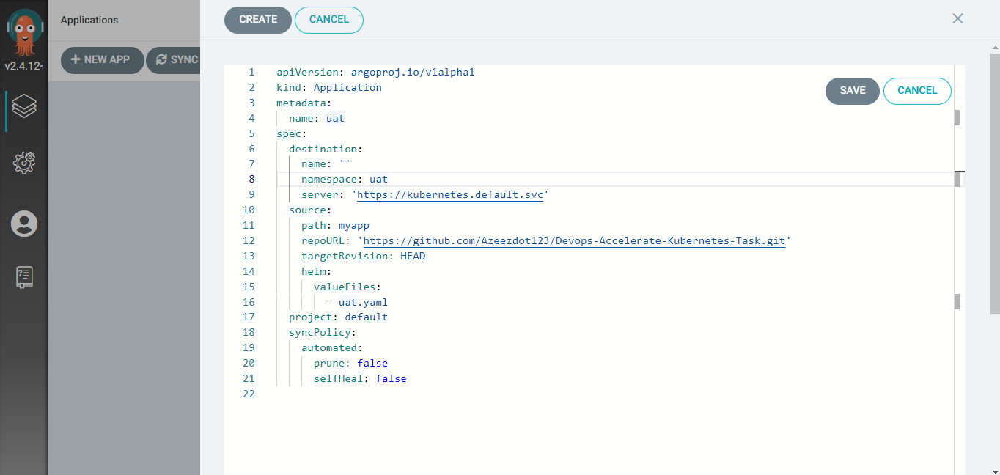
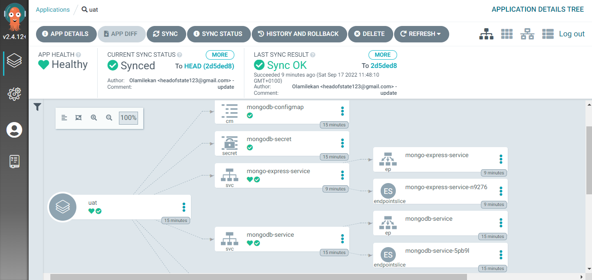
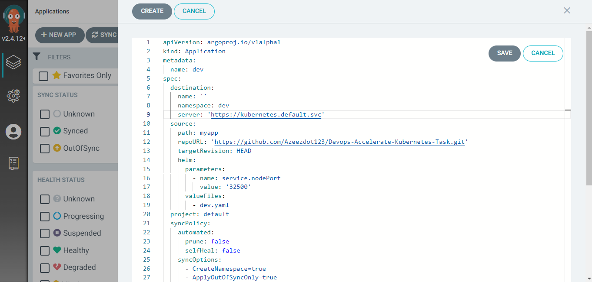
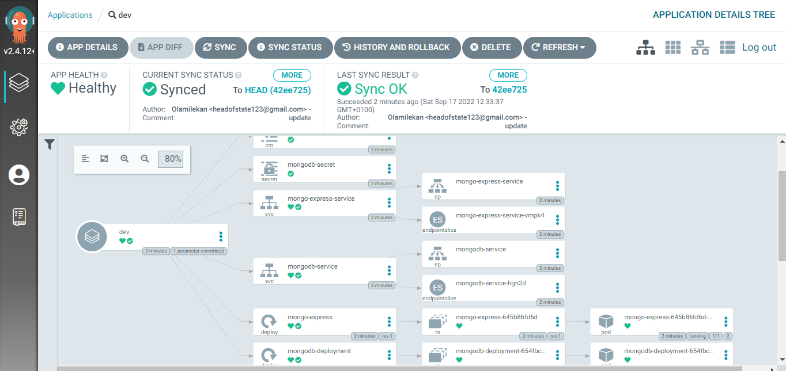
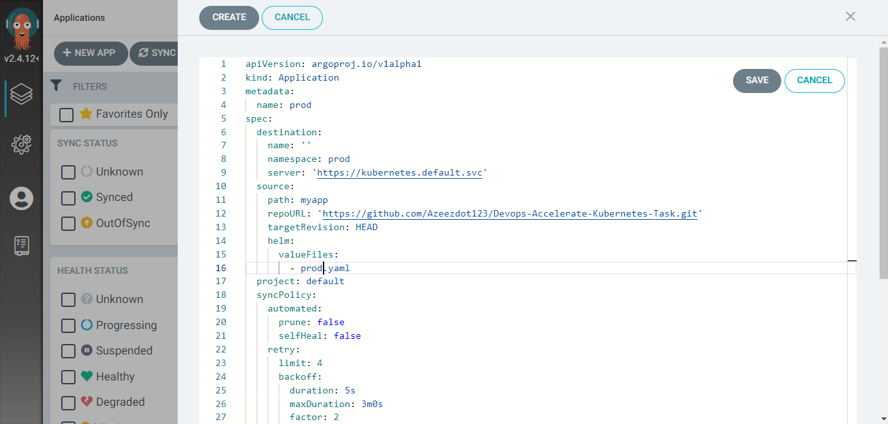
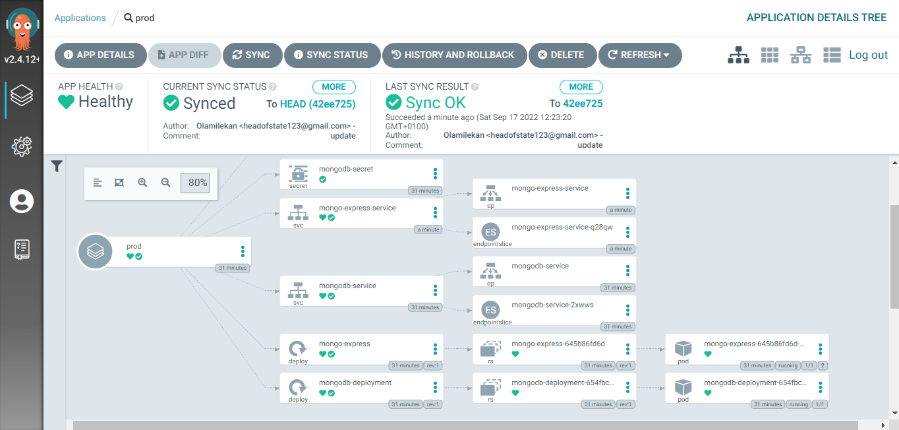
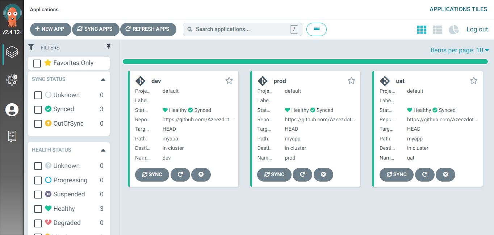

# Deploying Application to kubernetes Cluster using ArgoCD

I setup the application with the k8 manifest.

I also create the helm chart.

I create an eks cluster cause i was unable to run docker and minikube on my system.
 I first install the helm chart to my Cluster.
 

## I create the argocd app using the web ui.
The uat namespace

The dev namespace

The prod namespace

All the argocd app were all in the Healthy state and synced.
