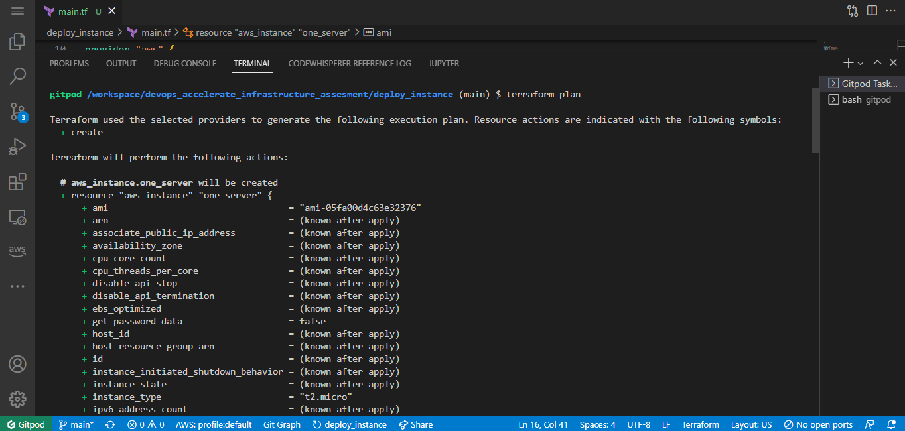
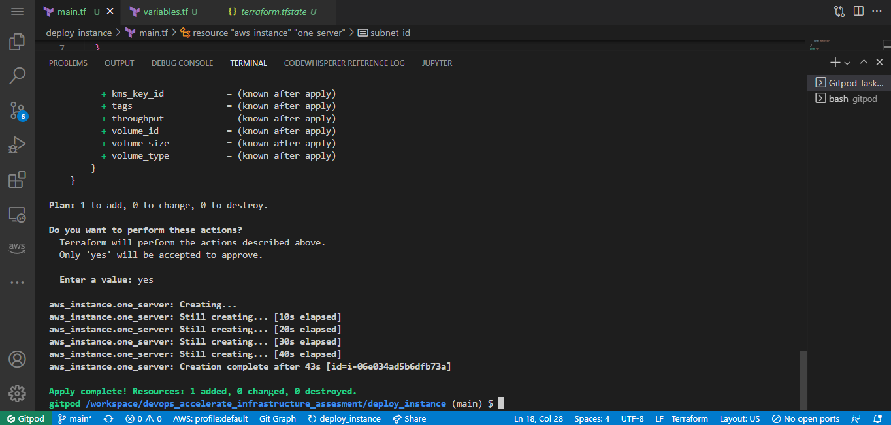
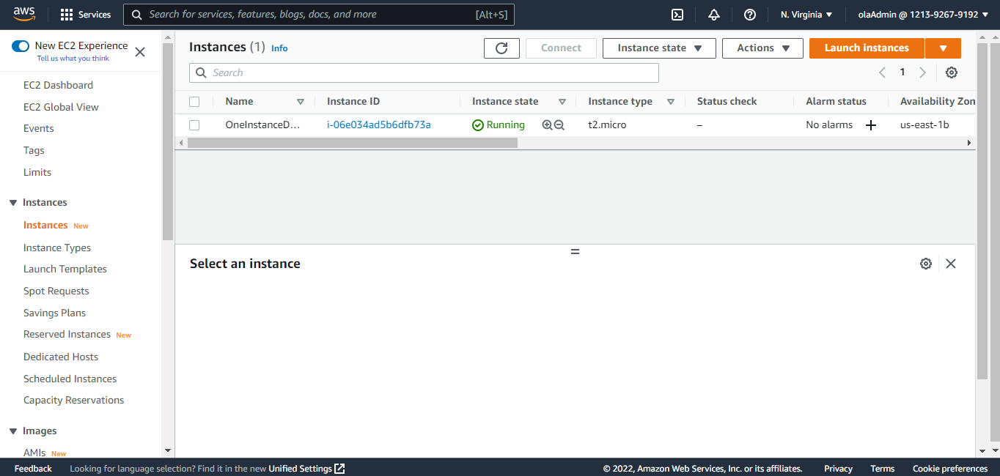
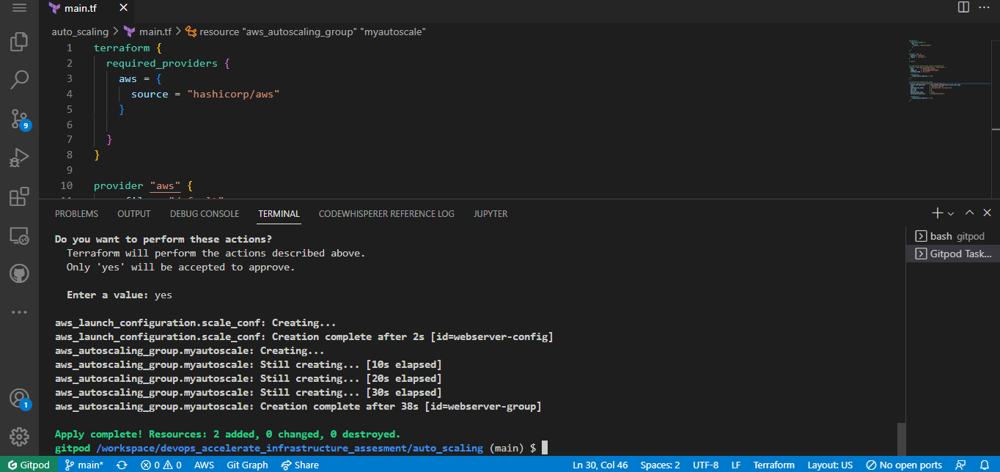
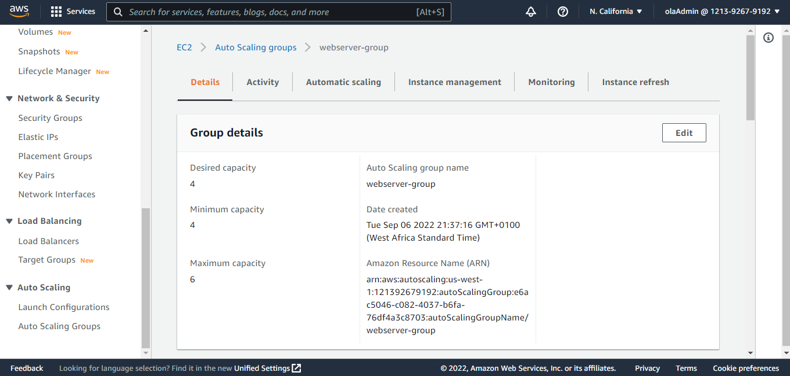

# devops_accelerate_infrastructure_as_code_assesment
In the first task, we were ask to provision an ec2 instance.
This is a screenshot of when I first run terraform plan and apply.

This is the screenshot of the instance provision using terraform

Also, we were given the task to provision a load balancer,  20 ec2 instances, and also deploy 6 web servers with high availability using terraform.

